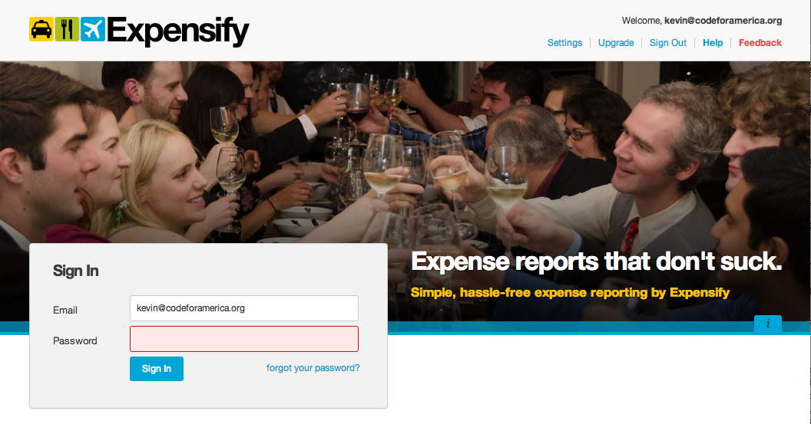
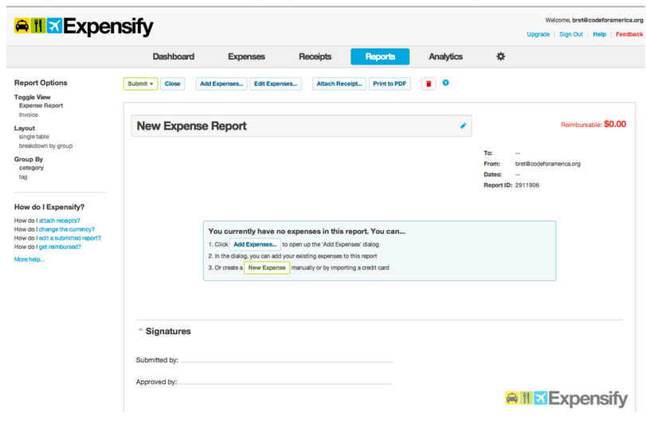
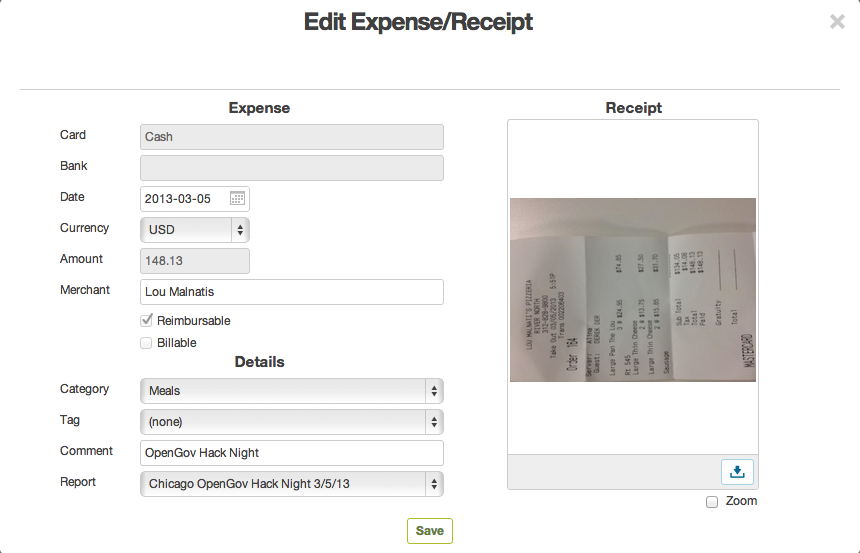

Brigade Handbook 

This handbook is a guide on how to access all the resources that the Brigade Network has to offer. 

[[TOC]]

# Things you should read

* [What is Civic Tech?, Christopher Whitaker](https://medium.com/@CivicWhitaker/what-is-civic-tech-b61a58c3eba8)

* [Code for America National Advisory Council,  Jill Bjers](https://medium.com/code-for-america/national-advisory-council-join-us-6641049e5094) 

* [So you want to reform democracy, Joshua Tauberer](https://medium.com/civic-tech-thoughts-from-joshdata/so-you-want-to-reform-democracy-7f3b1ef10597)

* [Beyond Tech: Policymaking in a digital age, Jen Pahlka ](https://medium.com/code-for-america/beyond-tech-policymaking-in-a-digital-age-2776b9a17b69)

# Organizing Resources 

## Code of Conduct & Safe Spaces Contact

### Code of Conduct

The Code for America community expects that Code for America network activities, events, and digital forums:

1. Are a safe and respectful environment for all participants.

2. Are a place where people are free to fully express their identities.

3. Presume the value of others. Everyone’s ideas, skills, and contributions have value.

4. Don’t assume everyone has the same context, and encourage questions.

5. Find a way for people to be productive with their skills (technical and not) and energy. Use language such as "yes/and", not “no/but.”

6. Encourage members and participants to listen as much as they speak.

7. Strive to build tools that are open and free technology for public use. Activities that aim to foster public use, not private gain, are prioritized.

8. Prioritize access for and input from those who are traditionally excluded from the civic process.

9. Work to ensure that the community is well-represented in the planning, design, and implementation of civic tech. This includes encouraging participation from women, minorities, and traditionally marginalized groups.

10. Actively involve community groups and those with subject matter expertise in the decision-making process.

11. Ensure that the relationships and conversations between community members, the local government staff and community partners remain respectful, participatory, and productive.

12. Provide an environment where people are free from discrimination or harassment.

Code for America reserves the right to ask anyone in violation of these policies not to participate in Code for America network activities, events, and digital forums.

### Code for America's Anti-Harassment Policy

This anti-harassment policy is based on [the example policy](http://geekfeminism.wikia.com/wiki/Conference_anti-harassment/Policy) from the Geek Feminism wiki, created by the Ada Initiative and other volunteers.

This policy is based on several other policies, including the Ohio LinuxFest anti-harassment policy, written by Esther Filderman and Beth Lynn Eicher, and the Con Anti-Harassment Project. Mary Gardiner, Valerie Aurora, Sarah Smith, and Donna Benjamin generalized the policies and added supporting material. Many members of LinuxChix, Geek Feminism and other groups contributed to this work.

* * *

All Code for America network activities, events, and digital forums and their staff, presenters, and participants are held to an anti-harassment policy, included below.

In addition to governing our own events by this policy, Code for America will only lend our brand and fund groups that offer an anti-harassment policy to their attendees. For information on how to offer an anti-harassment policy to your group, [see this guide](https://docs.google.com/a/codeforamerica.org/document/d/1Zg2FDt7awgfCmdcbzMwKHMb1A7KDOhs_z7ibCb3TLLQ/edit).

Code for America is dedicated to providing a harassment-free experience for everyone regardless of gender, gender identity and expression, sexual orientation, disability, physical appearance, body size, race, age, or religion. We do not tolerate harassment of staff, presenters, and participants in any form. Sexual language and imagery is not appropriate for any Code for America event or network activity, including talks. Anyone in violation of these policies may expelled from Code for America network activities, events, and digital forums, at the discretion of the event organizer or forum administrator.

Harassment includes but is not limited to: offensive verbal or written comments related to gender, gender identity and expression, sexual orientation, disability, physical appearance, body size, race, religion; sexual images in public spaces; deliberate intimidation; stalking; following; harassing photography or recording; sustained disruption of talks or other events; inappropriate physical contact; unwelcome sexual attention; unwarranted exclusion; and patronizing language or action.

If a participant engages in harassing behavior, the organizers may take any action they deem appropriate, including warning the offender or expulsion from Code for America network activities, events, and digital forums.

If you are being harassed, notice that someone else is being harassed, or have any other concerns, please contact a member of the event staff or forum administrator immediately. You can contact them at [EVENT ORGANIZER/FORUM ADMINISTRATOR EMAIL AND PHONE NUMBER]. Event staff or forum administrators will be happy to help participants contact hotel/venue security or local law enforcement, provide escorts, or otherwise assist those experiencing harassment to feel safe for the duration of the event.

If you cannot reach an event organizer or forum administrator and/or it is an emergency, please call 911 and/or remove yourself from the situation.

You can also contact Code for America about harassment at safespace@codeforamerica.org and feel free to use the email template below. Code for America staff acknowledge that we are not always in a position to evaluate a given situation due to the number of events and the fact that our team is not always present. However, we are hopeful that by providing these guidelines we are establishing a community that jointly adheres to these values and can provide an environment that is welcoming to all.

We value your attendance and hope that by communicating these expectations widely we can all enjoy a harassment-free environment.

####Email Template for Anti-Harassment Reporting

SUBJECT: Safe Space alert at [EVENT NAME]

I am writing because of harassment at a Code for America Communities event, (NAME, PLACE, DATE OF EVENT).

You can reach me at (CONTACT INFO). Thank you.

## Slack 

* To join Slack, fill this out [https://cfa.typeform.com/to/RfZuFF](https://cfa.typeform.com/to/RfZuFF)

    * You can also forward this link to other members of your Brigade

* Slack Policy: [https://github.com/codeforamerica/slackpolicy](https://github.com/codeforamerica/slackpolicy) 

    * Code for America has a code of conduct that applies to our spaces and events, including this the Code for America Slack channel.This [Code of Conduct can be found here.](https://github.com/codeforamerica/codeofconduct)

    * Please be aware that Code for America staff may remove users *at will for any reason* and *will* remove any user that Code for America staff deems to be violating the Code for Conduct or are being disruptive.

    * While Slack can be a great place to network, it should not be used to pitch companies or products without prompting. The expection to this is if people are looking for hire talent and are more than welcome to post in the #jobs-for-america channel.

    * Please note that there are several government staff here in the Slack and any conversations posted in public channels may be subject to a Freedom of Information Act Request. Combined with the size of our Slack, users should treat the Code for America Slack the same way you would a message on a public forum.

    * To keep pings down, the #announcements channel is admin-only channel. The @channel and @here commands have been disabled.

    * Feel free to create channels, but keep in mind that Slack channels that are not active for three consecutive months will be archived.

    * Please note that Code for America is a 501(c)3 non-partisan organization. This particular Slack should not be used for planning partisan activities. For examples of what Code for America considers partisan activity [please see these guidelines:](https://docs.google.com/a/codeforamerica.org/document/d/1MdAkYUV8CqI1szC0O8Erc6_7bHnoPLOPMDw9z_OdFTQ/edit?usp=sharing)

    * Only staff members of Code for America are allowed to integrate bots, if you would like to add a bot please DM @civicwhitaker.

    * New users are asked take a moment to update your profile with your first and last names, title, and organization so people have a better chance of knowing who you are: [https://cfa.slack.com/account/profile](https://cfa.slack.com/account/profile)

    * If you ever have any questions or issues, please feel free to ping @civicwhitaker who moderates our Slack forum. If you are being harassed on our Slack, you may also contact safespace@codeforamerica.org.

## Meetup 

We’ve got something new to offer you about Meetup. They just released a new product called Meetup Pro, here is ours: [http://www.meetup.com/pro/brigade/](http://www.meetup.com/pro/brigade/) 

Meetup Pro gets us a bunch of new cool data and options. Most important though, it makes it possible for us to pay for your Meetup bill. I don’t want to barge in on your accounts though. If you’d like us to pay for your account, please opt in by filling out this form: [http://goo.gl/forms/eG5cRZcEPS](http://goo.gl/forms/eG5cRZcEPS).

What Meetup Pro gets you:

* We’ll pay for your Meetup out of the Brigade operating budget, saving you $180 a year. 

* You’ll retain full control of your Meetup as a co-organizer.

* You’ll lose the ability to charge dues and have them go to your own separate bank account.

What Meetup Pro get us:

* [http://www.meetup.com/pro/brigade/](http://www.meetup.com/pro/brigade/)

* New data! Historical membership numbers! Avg rsvps counts, etc.

* The ability to message all Brigade 50,000 volunteers … 

We’d like to use the messaging ability to send the occasional messages to your membership. These will be limited to things like "Announcing National Day of Civic Hacking" and a one a quarter reminder about signing up for the Code for America email list to get the latest updates. 

Instructions:

1. Opt in by telling us your Meetup url at: [http://goo.gl/forms/eG5cRZcEPS](http://goo.gl/forms/eG5cRZcEPS).

2.  We’ll then join your group with our [brigade-info@codeforamerica.org](mailto:brigade-info@codeforamerica.org) account.

3. You’ll promote us to be the main Organizer, while you remain a co-Organizer.

4. We’ll click some buttons on our end and then you’ll show up at [http://www.meetup.com/pro/brigade/](http://www.meetup.com/pro/brigade/) and your bill will start to be paid by us.

Meetup Pro costs us per group, so we can only add Official Brigades. Also, if you have already paid for your Meetup, then you’ve already paid, we can’t get you a refund, sorry. 

## Playbook 

The Code for America Brigade organizers playbook is a collection of guides that can help you organize your brigade. [It can be found here.](http://brigade.codeforamerica.org/brigade/organize/playbook/)

## National Advisory Council 

The National Advisory Council is an elected group of Brigade members that represents the community to Code for America staff. They are: 

* Jill Bjers, Code for Charlotte

* Jason Hibbets, Code for Raleigh

* Chris Alfano, Code for Philly

* Noel Hidalgo, BetaNYC

* Vyki Englert, Hack for LA

* Luigi Ray-Montanez, Code for Atlanta

* Harlan Weber, Code for Boston

* Neil Planchon, OpenOakland

* Andrew Kozlik, Code for Orlando


You can reach the NAC by emailing [NAC@codeforamerica.org](mailto:NAC@codeforamerica.org) 

## Brigade Action Teams

One of the primary NAC goals is to determine ways all Brigade members can connect with the national community and its efforts.

**How it works:** 

Each Brigade Action Team will be led by one member of the National Advisory Council with other NAC members and a Code for America staff member providing support. The action team will be comprised of individual brigade members.


For example, the Knowledge Sharing BAT will be lead by me, Luigi and Neil will be supporting NAC members, Nicole will be our CFA staff member. However, the team will mostly be comprised of brigade members interested in helping work on creating, curating and maintaining a shared knowledge base.


It’s important to note, the Brigade Action Teams will not just be open to captains but to all brigade members. In preparation for this, Code for America will be opening up their Slack instance so that we can better coordinate efforts. This effort will be ramping up over the next few weeks starting with existing Brigade members and city partners before opening it up further. This will also enable Brigade Members to participate directly in the national network.
Not all BATs are ready for roll out. However, we want to give you a heads up on the areas that we feel need specific focus. Our intent is to pilot the idea with the first three or four listed below and then scale:

* Trust: Fostering a more intentionally inclusive and diverse network this team will create best practices, tips for heading off conflict and be the the point person Code of Conduct concerns.

* Days of Action: Spearheading Brigade national days of action, such as Open Data Day and Hack for Change, and a possible Brigade Summit in 2017.

* Badges & Recognition Team: Expanding the Brigade Awards (introduced at last Summit) and start awarding badges for both Brigades and individual contributors quantifying brigades and their team members’ impact.

* Knowledge Sharing: Gathering and curating our knowledge across the network into a useable database of best practices, tips & tricks, and ways to learn from each other.

* Fundraising: Identifying and tracking sources of funding and in-kind donations for the Brigade Network and work with Code for America to develop a way to support brigades.

* Marketing Plan: Developing a marketing plan for recruitment and highlight the impact brigades are having at the local level.

* Cross Brigade Collaboration: Increasing project delivery and management by developing standards for re-deployable apps and project management tools.

* Mentorship and Training: Connecting brigades with leadership mentors, government partnerships and training.


[Now that you’ve read through them, show your interest in a BAT here.](https://docs.google.com/a/codeforamerica.org/forms/d/1L8EUy8mNP7kRtTT9o-BgWQhht9aVw1dAYL2EM7Rkdi8/edit) This isn’t a commitment, but rather a starting point. We’ll be reaching out as they are launched.

# Technical Resources 

## In-kind donations 

For brigades please contact brigade-info@codeforamerica.org to request access or if your a staff member than ask your team lead or email inkinds@codeforamerica.org. Once you have stopped using a service, please alert

**Cloud Hosting**
*AWS*
If you're in a brigade or a CFA staff member you can get free AWS usage, a cloud hosting service that provides a lot of customizable services and tools. Brigades have access to [AWS Activate](https://aws.amazon.com/activate/), a program that AWS administers themselves, and can host indefinitely for free.

*Heroku*
Heroku is a simple, easy-to-use cloud hosting service and we are giving access on a case by case basis for non-staff members. Contact [brigade-info@codeforamerica.org](mailto:brigade-info@codeforamerica.org)  if you're  interested. 

**Mapping Software**
Carto (Formerly CartoDB)
Carto is a web application which helps people visualize and work with GIS data. Access is unlimited. Email santiagogiraldo@carto.com with your access request tell them "CfA sent you" cc'ing inkinds@codeforamerica.org.

**Design, UI, UX**
*InVision*
InVision is a web application that helps teams prototype and share frontend UI's. CfA has access to a shared account for staff, and can grant access to individual staff and Brigade members. Contact us for access.

**Github**
CfA has access to unlimited private repositories for staff. We can create a private repository for any brigade member who requests it.

# Financial Resources 

## Donate Page 

Code for America’s Donate Page (codeforamerica.org/donate) can be used for people to donate funds to your Brigade. We will notify you automatically if we receive a donation for your Brigade. The donate page will take about 10% of your donation for processing fees. 

## Brigade Finance Spreadsheet 

The Brigade Finance Spreadsheet is the canonical source for seeing how much funds your Brigade has access to. [You can find that spreadsheet here](https://docs.google.com/a/codeforamerica.org/spreadsheets/d/1ORwvp9rPOidH-bhTAfzSmUGWpi7AHOKyhrgCKZmkGKQ/edit?usp=drive_web). It’s updated every 1st and 15th. 

## Expensify 

If Code for America is intaking funds for your Brigade, you can use this process to get reimbursed. 

*Process for Reimbursement through Expensify*

* You need to be invited to join Expensify on the CfA Policy. Please email [christopher@codeforamerica.org](mailto:christopher@codeforamerica.org) and request an invite.

* Add your bank account information (under settings). Expensify will reimburse you directly

    * For more help, visit: **[http://help**.](http://help.expensify.com/direct_deposit/)**[expensif**y](http://help.expensify.com/direct_deposit/)**[.com/direct_deposit**/](http://help.expensify.com/direct_deposit/)

* Create an expense report, upload picture of receipt and tag expenses appropriately

* Submit your expense report to Christopher Whitaker [christopher@codeforamerica.org](mailto:christopher@codeforamerica.org) Cc [brigade-info@codeforamerica.org](mailto:brigade-info@codeforamerica.org)

*Tagging your expense reports appropriately *

*if you are submitting expense reports for Summit travel reimbursement, please scroll down for Summit travel guidelines*  

Instructions for  "Class" and the “Category” pull down menus: 

The CLASS will now be Programs\BRIGADE\Brigades

The CATEGORY will now be your Brigade Expense\Brigade city 

            	Example: Atlanta Brigade,  Boston Brigade, Albuquerque Brigade….etc

*                Please do not chose categories such as non staff travel, meeting & events.*

*Tagging your expense reports appropriately for **2016 Summit Travel** Reimbursement: *

If you have been approved for travel reimbursement for Summit 2016, please follow these instructions

Please write: "**2016Summit**" in both the report heading and comment fields

Instructions for  "Class" and the “Category” pull down menus:

The CLASS will be Programs\BRIGADE\Brigade Management

The CATEGORY will be your Travel and Events\Non-Staff Travel 

NOTES: 

* For airline tickets: expense reports need to show method of payment (credit card) and will **not **get reimbursed for any non-cash (air miles, vouchers, discounts) payments

* Other airline ticket reminders: 

    * Receipts should show:

        * Name of person claiming reimbursement

        * Date of charge

        * Amount

        * Payment backup (as opposed to an invoice copy)

            * Method of payment (cash/check VISA/AMEX etc.)

            * If you apply discounts such as air miles, gift cards, we will reimburse you for the net charges, after discounts

        * For airline tickets. Attach email that shows the itinerary (& name, date of charge, amount)

*Timeline for submitting expense reports: *

Expense reports must be submitted **by the last day** of the expense month.

For example: A purchase made on January 18th, must be submitted **by January 31st**. A purchase made on January 31st, must be submitted **by January 31st**. 

*Detailed step by step process for submitting expense reports *

1. You need to be invited to join Expensify on the CfA Policy. Please email [christopher@codeforamerica.org](mailto:christopher@codeforamerica.org) and request an invite. If you’ve already been invited, log into your account at [Expensify.com](https://www.expensify.com/).

2. Create a New Report

3. Fill in the report 

    1. Name of Report should be [Your City/Brigade; Month]

        1. i.e. "Code for San Francisco: April 2014"

4. Upload receipts and attach them to the report. Expensify has a mobile app that makes it easy to take photos of your receipts and upload them to Expensify.

**Note: ****the REIMBURSABLE button needs to be checked to receive reimbursement**

5. The CLASS will now be Programs\BRIGADE\Brigades

6. The CATEGORY will now be your Brigade Expense\Brigade city 

    2. Example: Atlanta Brigade,  Boston Brigade, Albuquerque Brigade….etc

    3. *Please do not chose categories such as non staff travel, meeting & events.*

7. Each month should have a separate expense report. For example, expenses from January 2015 should be separate from February 2015 expenses.

8. Submit the report

    4. To: [christopher@codeforamerica.org](mailto:christopher@codeforamerica.org) 

    5. CC: [brigade-info@codeforamerica.org](mailto:brigade-info@codeforamerica.org)

9. Brigade Support Team will either approve. When approved the expense report goes to Code for America Ops Team for fulfillment. 

*Process for Code for America Paying Vendor Directly on a Brigade's Behalf *

We understand that the cost of Brigade events and meetups can add up. Code for America can help by paying a vendor directly on your Brigade's behalf. 

Here's how it works:

1. Brigade Captain checks in with Code for America by emailing [christopher@codeforamerica.org](mailto:christopher@codeforamerica.org) at least three weeks ahead of payment due date to confirm that Code for America will pay the expense.

    1. Email should contain price quote from the vendor. Christopher will check this against your available budget.

2. If approved, vendors must prepare a final invoice and send the invoice **via email** to [codeforamerica@bill.com](mailto:codeforamerica@bill.com) CC: [vishal@codeforamerica.org](mailto:vishal@codeforamerica.org) and [brigade-info@codeforamerica.org](mailto:brigade-info@codeforamerica.org) 

3. Please also have the vendor supply a completed W9 with the invoice. [www.irs.gov/pub/irs-pdf/fw9.pdf](http://www.irs.gov/pub/irs-pdf/fw9.pdf)

NOTES: 

* Code for America pays invoices every Wednesday morning. Please keep that in mind as you coordinate this process.

Questions? Let us know at [brigade-info@codeforamerica.org](mailto:brigade-info@codeforamerica.org) 

